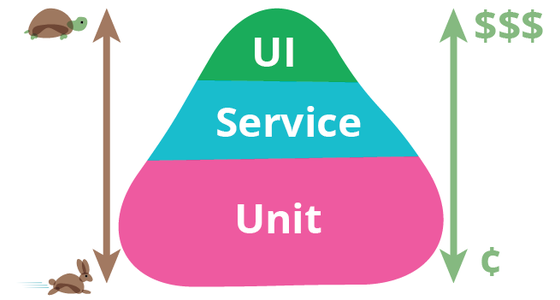
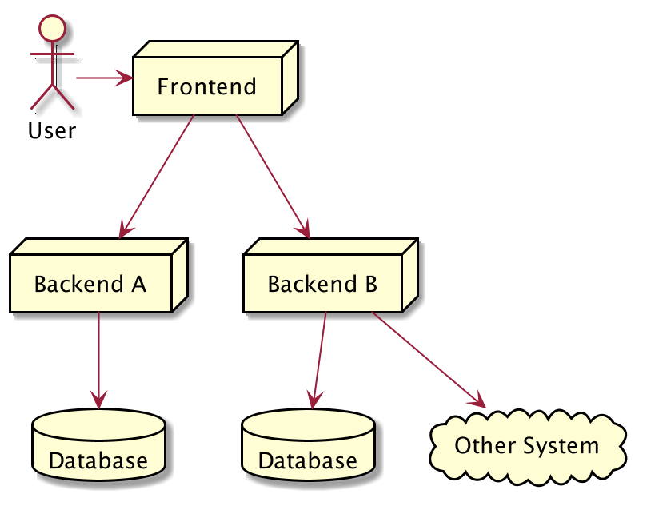
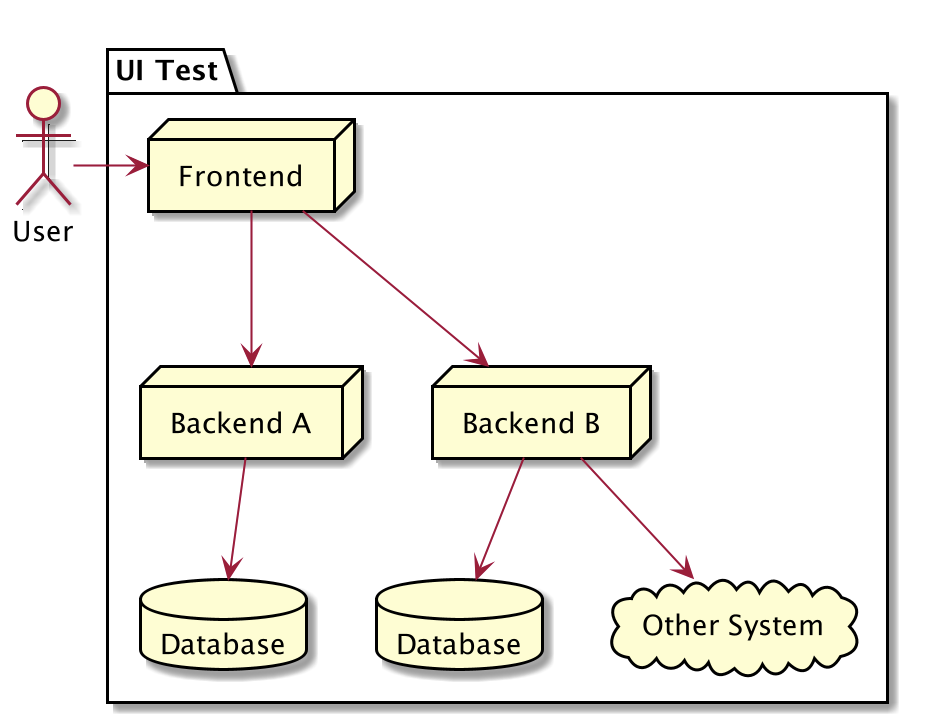
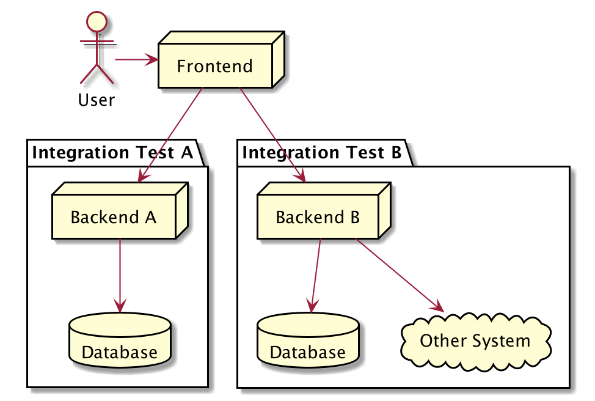
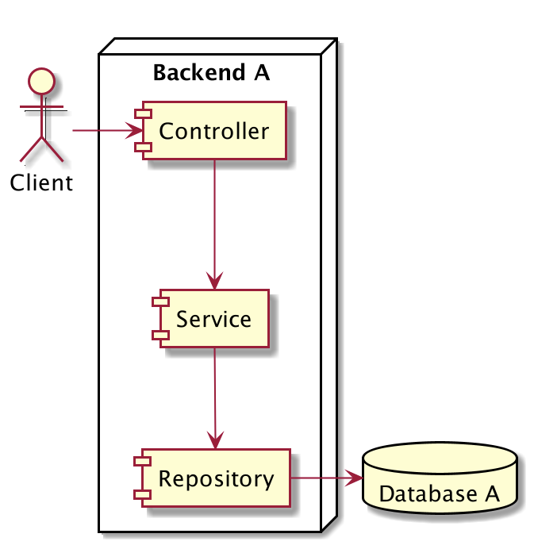
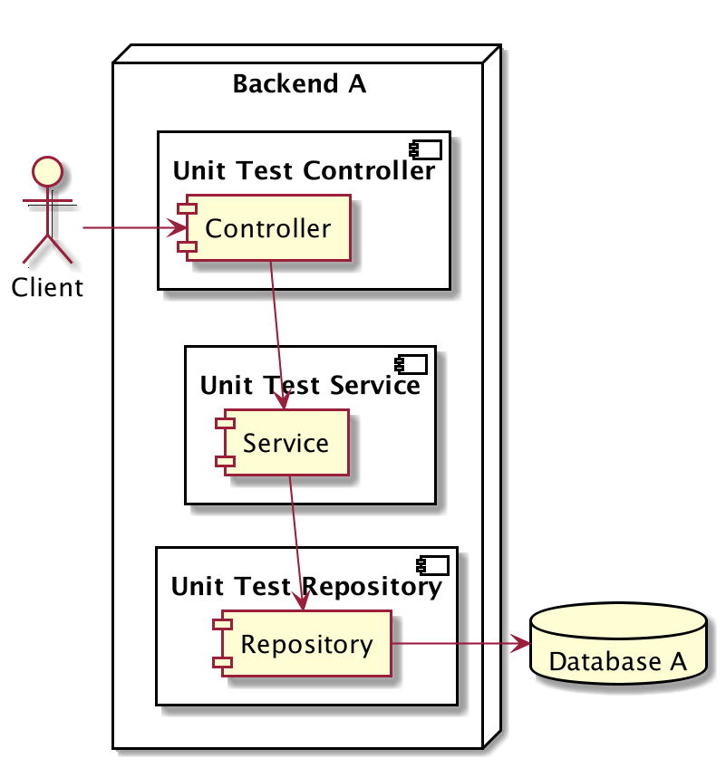

# Unit Test

## Sebelum Belajar Materi Ini

- Kotlin Dasar
- Kotlin Object Oriented Programming
- Kotlin Generic
- Kotlin Collection
-Gradle
- [Kotlin Course]([https://www.udemy.com/course/pemrograman-kotlin-pemula-sampai-mahir/?referralCode=98BE2E779EB8A0BEC230])

## Pengenalan Software Testing

- Software testing adalah salah satu disiplin ilmu dalam software engineering
- Tujuan utama dari software testing adalah memastikan kualitas kode dan aplikasi kita baik
- Ilmu untuk software testing sendiri sangatlah luas, pada materi ini kita hanya akan fokus ke unit testing

## Test Pyramid

## Contoh High Level Architecture Aplikasi

- ### UI Test / End to End Test

- ### Service Test / Integration Test

## Contoh Internal Architecture Aplikasi

- ### Unit Test

## Unit Test

- Unit test akan fokus menguji bagian kode program terkecil, biasanya menguji sebuah function
- Unit test biasanya dibuat kecil dan cepat, oleh karena itu biasanya kadang kode unit test lebih banyak dari kode program aslinya, karena semua skenario pengujian akan dicoba di unit test
- Unit test bisa digunakan sebagai cara untuk meningkatkan kualitas kode program kita

###Source:

#### Programmer Zaman Now

- [Youtube Channel](https://www.youtube.com/c/ProgrammerZamanNow)
- [Yotube Playlist](https://www.youtube.com/watch?v=nsKGgZJEjIs&list=PL-CtdCApEFH8HoTBUpYgQ-Q45U54Tn_up&index=1)
- [Udemy Course](https://www.udemy.com/course/pemrograman-kotlin-pemula-sampai-mahir/?referralCode=98BE2E779EB8A0BEC230)