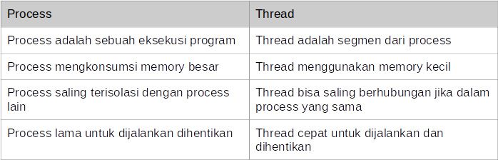

# Pemahaman yang Dibutuhkan

- Kotlin Dasar.
- Kotlin Object Oriented Programming.
- Kotlin Generic & Collection.
- Gradle.
- Kotlin Unit Test. 
- [Udemy Programmer Zaman Now](https://www.udemy.com/course/pemrograman-kotlin-pemula-sampai-mahir/?referralCode=98BE2E779EB8A0BEC230)

# Agenda Materi

- Pengenalan Parallel dan Concurrency Programming.
- Thread, ExecutorService dan Future.
- Pengenalan Coroutine.
- Job.
- Async Function.
- Deferred.
- Coroutine Context, Dispatcher dan Scope.
- Channel, Flow dan lain-lain.

# Pengenalan Parallel Programming

- Saat ini kita hidup di era multicore, dimana jarang sekali kita menggunakan prosesor yang single core.
- Semakin canggih perangkat keras, maka software pun akan mengikuti, dimana sekarang kita bisa dengan mudah membuat proses parallel di aplikasi..
- Parallel programming sederhananya adalah memecahkan suatu masalah dengan cara membaginya menjadi yang lebih kecil, dan dijalankan secara bersamaan pada waktu yang bersamaan pula.

## Contoh Prallel

- Menjalankan beberapa aplikasi sekaligus di sistem operasi kita (office, editor, browser, dan lain-lain).
- Beberapa koki menyiapkan makanan di restoran, dimana tiap koki membuat makanan masing-masing.
- Antrian di Bank, dimana tiap teller melayani nasabah nya masing-masing.

# Process vs Thread

