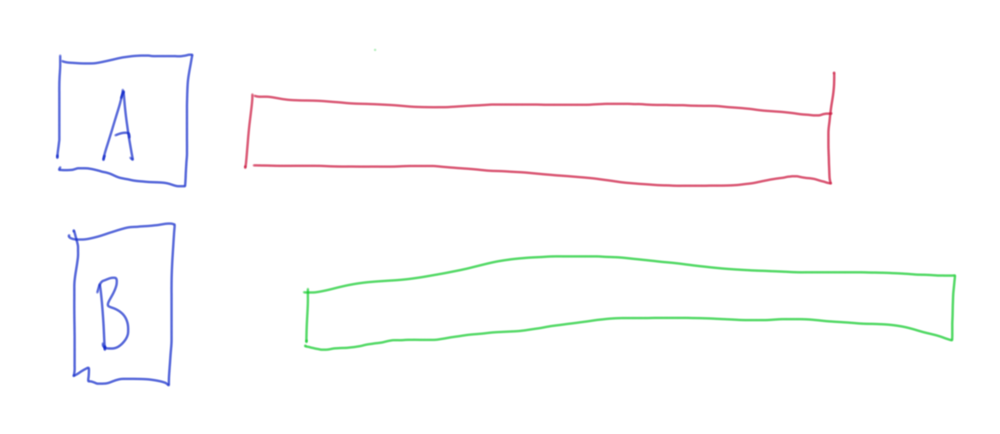

# Parallel vs Concurrency

- Berbeda dengan paralel (menjalankan beberapa pekerjaan secara bersamaan), concurrency adalah menjalankan beberapa pekerjaan secara bergantian.
- Dalam parallel kita biasanya membutuhkan banyak Thread, sedangkan dalam concurrency, kita hanya membutuhkan sedikit Thread.

# Diagram Parallel

# Diagram Concurrency

# Contoh Concurrency

- Saat kita makan di cafe, kita bisa makan, lalu ngobrol, lalu minum, makan lagi, ngobrol lagi, minum lagi, dan seterusnya. Tetapi kita tidak bisa pada saat yang bersamaan minum, makan dan ngobrol, hanya bisa melakukan satu hal pada satu waktu, namun bisa berganti kapanpun kita mau.

# CPU-bound

- Banyak algoritma dibuat yang hanya membutuhkan CPU untuk menjalankannya. Algoritma jenis ini biasanya sangat tergantung dengan kecepatan CPU.
- Contoh yang paling populer adalah Machine Learning, oleh karena itu sekarang banyak sekali teknologi Machine Learning yang banyak menggunakan GPU karena memiliki core yang lebih banyak dibanding CPU biasanya.
- Jenis algoritma seperti ini tidak ada benefitnya menggunakan Concurrency Programming, namun bisa dibantu dengan implementasi Parallel Programming.

# I/O-bound

- I/O-bound adalah kebalikan dari sebelumnya, dimana biasanya algoritma atau aplikasinya sangat tergantung dengan kecepatan input output devices yang digunakan.
- Contohnya aplikasi seperti membaca data dari file, database, dan lain-lain.
- Kebanyakan saat ini, biasanya kita akan membuat aplikasi jenis seperti ini.
- Aplikasi jenis I/O-bound, walaupun bisa terbantu dengan implementasi Parallel Programming, tapi benefitnya akan lebih baik jika menggunakan Concurrency Programming.
- Bayangkan kita membaca data dari database, dan Thread harus menunggu 1 detik untuk mendapat balasan dari database, padahal waktu 1 detik itu jika menggunakan Concurrency Programming, bisa digunakan untuk melakukan hal lain lagi.

